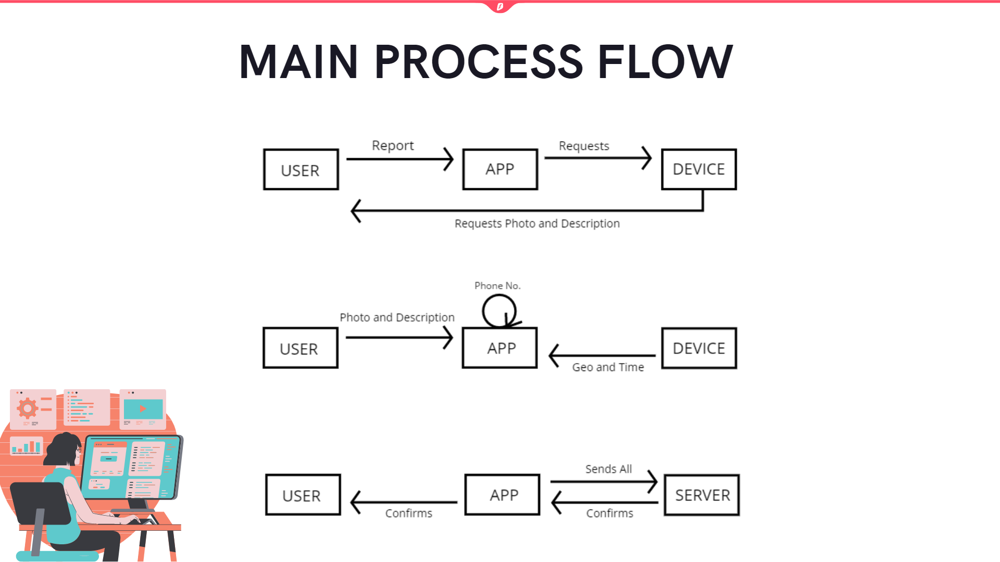
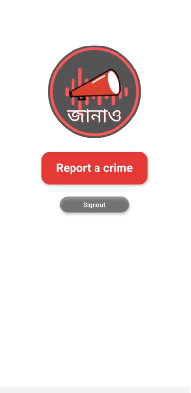
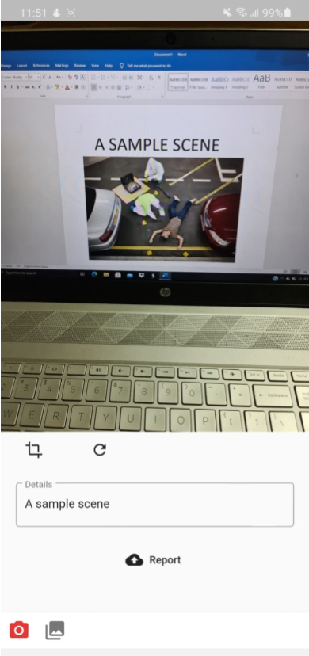

# Janao
A public service application. Helps user to send image, location and necessary information of a crime scene immediately to the law enforcement agency.
To know abouth the details of the app <a href="https://www.canva.com/design/DAEI0SXRzdQ/i9nDBlodO69eQ7id9ECVRg/view?utm_content=DAEI0SXRzdQ&utm_campaign=designshare&utm_medium=link2&utm_source=sharebutton">click here<a>.

**System** 
The system is built using Flutter and Firebase is used as the database. For cloud storage it uses firebase cloud storage.

**Application** 

**Contributors** < /br>

 
 

